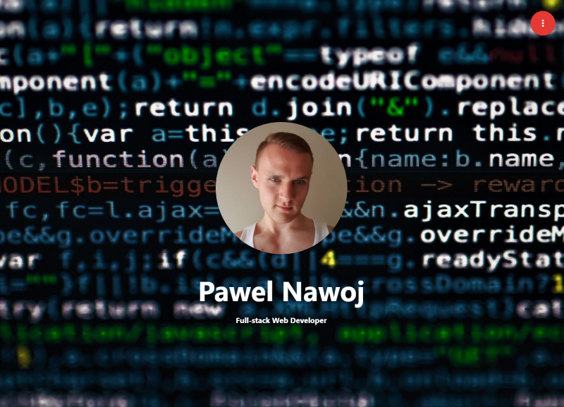

# Portfolio

## Table of content
* [About](#about-the-project)
* [Usage](#usage)
* [Improvements](#Improvements)
* [Built with](#built-with)
* [Acknowledgements](#Acknowledgements)
* [Contact me](#contact-me)
## About the project
Portfolio website created to express my HTML, CSS and JavaScript knowledge. It also contains brief informations about myself, technologies that I have learnt, contact details and useful links. The website also makes it possible to download my resume.

## Usage    
Website is deployed on GitHub Pages: [https://pavn93.github.io/Portfolio/](https://pavn93.github.io/Portfolio/).    
Floating button gives a few extra options like side menu with contact details where the email address and phone number can be copied with one click and resume downloaded. This informations are also listed further down on the page. 

## Improvements
* I noticed that on some browsers the parallax effect does not work properly. This is probably a materialize issue.    
* I wish to introduce the animations as I already have some experience with them as soon as I will have some time.    
* The color palette might not be the best, I wish to improve on it at some point, for now I only wanted things to be clean and readable.    
* Footer needs some more work, there is still room for more information.    
## Built with
* [Visual Studio Code](https://code.visualstudio.com/)    
* [MaterializeCSS](https://materializecss.com/)    
* [jQuery](https://jquery.com/)    
* JavaScript    
* HTML    
* CSS    
## Acknowledgements
* [W3Schools](https://www.w3schools.com/)
* [StackOverflow](https://stackoverflow.com/)
* [Markdown Cheat Sheet](https://www.markdownguide.org/cheat-sheet/)
## Contact me
Pawel Nawoj  
See my [GitHub Profile](https://github.com/PavN93)    
email: paweln993@gmail.com

